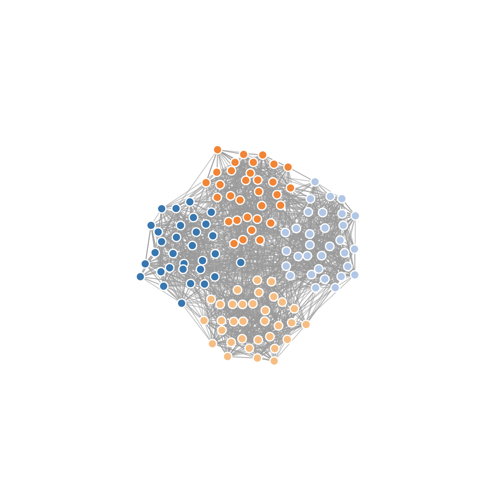
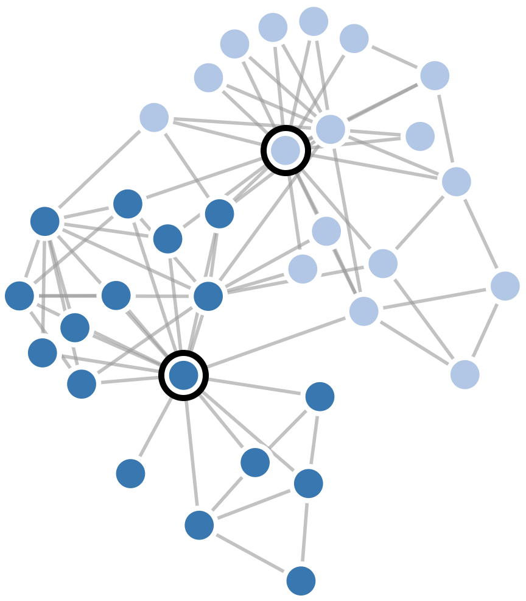
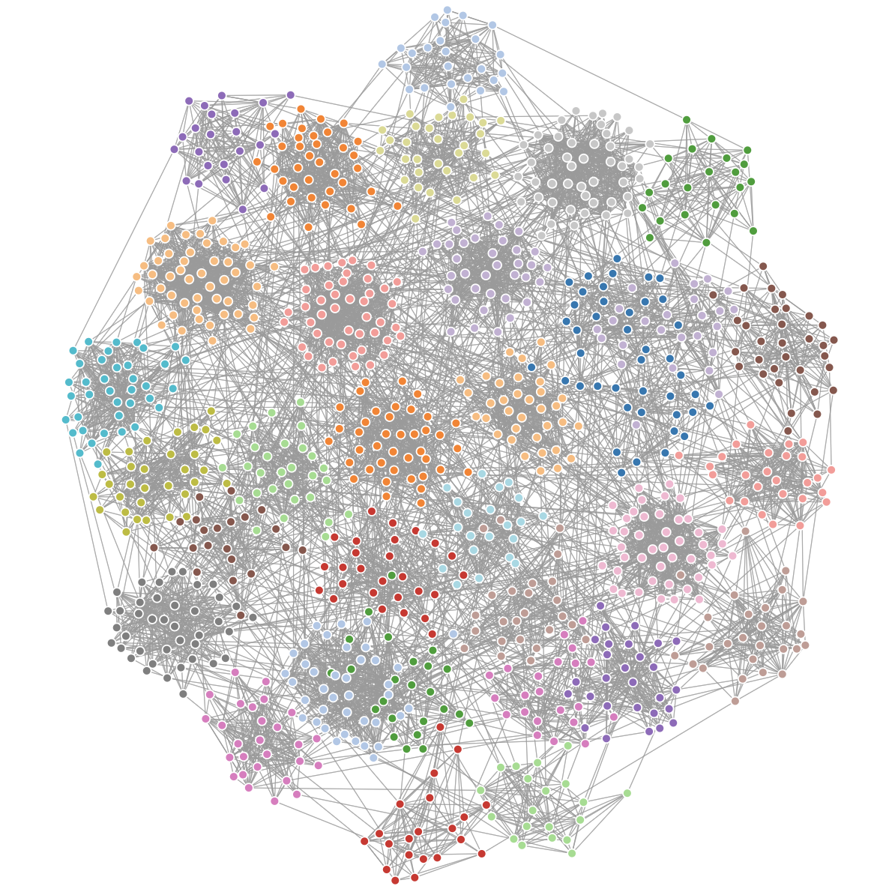

# MSc Thesis 
[https://mscthesis.herokuapp.com/](https://mscthesis.herokuapp.com/) (please, allow a few seconds for the website to load)

## Community Finding (CF) in Phylogenetic Trees using PHYLOViZ Online

The aim of the thesis was to develop an improved version of [PHYLOViZ](http://www.phyloviz.net/) Online by
implementing CF algorithms, as well as, adding new tools for
data visualization. Similar algorithms are being used in other domains. In
phylogenetics, it is a step forward for handling infectious diseases.

This tool is intended to assist distinct health professionals, including doctors and
bioinformaticians, and is designed to enable medical and research purposes.

### Implemented Algorithms

- Louvain;
- Infomap;
- Label propagation;
- Weighted label propagation;
- Layered label propagation.

### Benchmark
#### Synthetic Networks
- Girvan-Newman and Lancichinetti-Fortunato-Radicchi networks.

#### Real Networks
- [Stanford Large Network Dataset Collection](http://snap.stanford.edu/data/index.html);
- [Network Repository](http://networkrepository.com/).

#### Benchmarking Parameters
##### Accuracy
- Congruence calculations: [Adjusted Rand](http://www.comparingpartitions.info/?link=Tool), [Adjusted Wallace](http://www.comparingpartitions.info/?link=Tool) and [Normalized Mutual Information](http://www.comparingpartitions.info/?link=Tool);
- Diversity measures: [Simpson's Index of Diversity](http://www.comparingpartitions.info/?link=Tool);

##### Speed
- Comparison on the time required by each algorithm to return the communities present in a given network.

### Visualization Interface

- [Cytoscape.js](http://js.cytoscape.org/);
- [D3.js (Version 4 & SVG)](https://bl.ocks.org/pkerpedjiev/f2e6ebb2532dae603de13f0606563f5b);
- [D3.js (Version 4 & Canvas)](https://bl.ocks.org/jodyphelan/5dc989637045a0f48418101423378fbd).

### User Guide

1. Insert text file (.txt) with data in this [format](https://github.com/warcraft12321/Thesis/blob/master/uploads/Input.txt) and "Input.txt" name. Or just use the standard file included in the app (for now), in other words, ignore the input field;
2. Choose visualization interface;
3. Choose CF algorithm;
4. Run;
5. Networks above are draggable, zoomable and pannable. 

### Supervision Team

Bruno Gonçalves ([iMM](https://imm.medicina.ulisboa.pt/pt/)) | Alexandre Francisco ([INESC-ID](https://www.inesc-id.pt/) & [IST](https://tecnico.ulisboa.pt/pt/)) | João Carriço ([iMM](https://imm.medicina.ulisboa.pt/pt/) & [IST](https://tecnico.ulisboa.pt/pt/))

### Status

[05/10/18] [1st EIT Health Students Workshop for Master of Technological Innovation in Health](https://www.eithealth.eu/-/a-workshop-for-students-on-eit-health-mtih) (Madrid, Spain). As a Master of Technological Innovation in Health student, I was invited to present a poster about my Master Thesis and to talk about my past academic achievements. During my speech, I was still able to suggest new ways of improving this European program, powered by EIT Health (a body of the EU). Bursary awarded.

[30/11/18 - 02/12/18] [Antimicrobial Resistance Hackathon 2018](http://eit-health.de/wp-content/uploads/2018/10/AMR_Hackathon_Flyer.pdf) (Heidelberg, Germany). I was selected to participate in a 3-day Antimicrobial Resistance Hackathon organized by EIT Health Germany. At the beginning, we were divided in teams of 6/7 elements that would proceed to an AMR analysis of a different EU country. Bursary awarded.

[21/12/18] Louvain algorithm implemented;

[13/01/19] Label Propagation, Weighted Label Propagation and Layered Label Propagation algorithms implemented.

[16/01/19] Infomap algorithm implemented;

[17/01/19] Improved code readability;

[18/01/19] Added compressed algorithms (for enhanced performance) - Credits to [UglifyJS 3](https://skalman.github.io/UglifyJS-online/); 

[19/01/19] Increased code robustness;

[21/01/19] Testing algorithms with big data (1) - Credits to [SNAP](http://snap.stanford.edu/data/index.html#socnets);

[02/02/19] Implemented D3.js (using Canvas and SVG) and Cytoscape.js interface. App deployed to a web server - Credits to [Heroku](https://dashboard.heroku.com/);

[04/02/19] Louvain algorithm bug corrected. Enhanced interface. User is now able to provide input of several parameters;

[12/02/19] Implemented 1 algorithm that generate Girvan-Newman synthetic network;

[19/02/19] Image of thesis app uploaded to [Docker Hub repo](https://cloud.docker.com/repository/docker/warcraft12321/thesis). Link between GitHub and Docker Hub established;

[24/02/19] First results were obtained applying different benchmarking techniques;

[01/03/19 - 03/03/19] [IMIM Industry & Innovation Day](http://eit-health.de/events/upcoming-events/imim-industry-innovation-day-2019/) (Mannheim, Germany). Poster presentation of master thesis to IMIM students (Heidelberg University, University Medical Center Groningen and Uppsala University students) and industry representatives (Roche, Merck, GeneWerk, EIT Health, Velabs, Cellzome, evid.one, EMBL...). Visit to Cubex 41 (start-up innovative center) was also included. Bursary awarded. 

[02/03/19] GN benchmark network algorithm corrected. It now accepts different mixing parameters and node degrees. JSON Zachary's karate club network created.

[06/03/19] Thesis document improved. GN benchmark network algorithm - performance optimized. New features in the web tool;

[08/03/19] Added benchmark data;

[12/03/19] Added C++ code that generates Lancichinetti-Fortunato-Radicchi synthetic networks. Credits to [Santo Fortunato](https://sites.google.com/site/santofortunato/);

[13/03/19] Started PHYLOViZ integration;

[14/03/19] C++ code (Lancichinetti-Fortunato-Radicchi network generator) running in JavaScript. Credits to [emscripten](https://emscripten.org/);

[14/03/19 - 15/03/19] [VII AEICBAS Biomedical Congress](http://abc.aeicbasup.pt/) (Porto, Portugal). Master thesis was classified in the top 20 in the scientific competition. This contest aimed to gather the best theses from the biomedical field.

[18/03/19] Staphylococcus analysis started;

[20/03/19] Website performance strongly optimized. Credits to [Pingdom](https://tools.pingdom.com/#5a6636fb35400000);

[21/03/19] Website performance optimized. Phylogenetic data analysis almost concluded;

[25/03/19] Phylogenetic data analysis improved. Results visualization working as intended;

[Next] Thesis writing.

### Screenshot

Fig. 1 - Amazon product co-purchasing network (10 000 samples) and detected communities. Using D3.js, SVG and Layered Label Propagation algorithm.

Fig. 2 - Girvan-Newman synthetic network. 
N = 128 | mix = 0.1 | k = 16 | Interface: D3.js & SVG.

Fig. 3 - Zachary's karate club network (JSON file in the repo).

Fig. 4 - Lancichinetti-Fortunato-Radicchi Benchmark Network.
N = 1000 | mix = 0.1 | avg_k = 15 | max_k = 50 | min_c = 20 | max_c = 50 | Interface: D3.js & SVG.